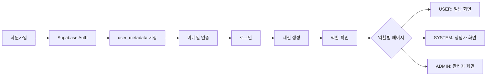

# Supabase 인증 연동 완료

## 변경 사항

### 1. `useAuth.js` 수정
- **기본 사용자 역할**: `ADMIN` → `USER`로 변경
- **Supabase 연동 활성화**: 주석 처리된 코드 활성화
- **로그인 상태**: 기본값 `false`로 변경 (실제 로그인 필요)
- **닉네임 필드 추가**: 사용자 메타데이터에서 닉네임 조회

## 테스트 방법

### 1. 회원가입 테스트

1. 브라우저에서 `/member/signup` 접속
2. 필수 정보 입력:
   - 이메일: `user@test.com`
   - 닉네임: `테스트유저`
   - 비밀번호: `test1234!` (최소 6자)
   - 비밀번호 확인: `test1234!`
   - 생년월일: `19900101`
   - MBTI: 선택 (예: ENFP)
   - 자기소개: 선택사항
3. "회원가입" 버튼 클릭
4. 회원가입 완료 모달 확인
5. "로그인으로" 버튼 클릭

### 2. 로그인 테스트

1. `/member/signin` 페이지에서 로그인
   - 아이디(이메일): `user@test.com`
   - 비밀번호: `test1234!`
2. "로그인" 버튼 클릭
3. 로그인 완료 모달 확인
4. 홈페이지로 자동 이동

### 3. 일반 사용자 화면 확인

로그인 후 다음 페이지들을 확인할 수 있습니다:

- **홈**: `/`
- **마이페이지**: `/mypage`
  - 회원정보 수정
  - 상담 내역
  - 내 작성 글
  - 내 작성 댓글
- **상담**: `/chat`
  - AI 상담
  - 상담사 상담
- **커뮤니티**: `/board`
- **정보**: `/info`

### 4. 로그아웃 테스트

1. 마이페이지 우측 상단 "로그아웃" 버튼 클릭
2. 홈페이지로 이동 확인
3. 로그인 상태 해제 확인

## Supabase 설정 확인

### .env 파일 확인

`.env` 파일에 Supabase 설정이 올바르게 되어 있는지 확인:

```env
VITE_SUPABASE_URL=https://fiharcnshoqnnyfhebqd.supabase.co
VITE_SUPABASE_ANON_KEY=sb_publishable__5NLTbiv3t6IgBnNswmimA_qBSsAdJ6
```

### Supabase 대시보드 확인

1. [Supabase 대시보드](https://supabase.com/dashboard) 접속
2. Authentication > Users 메뉴에서 가입한 사용자 확인
3. 사용자의 `user_metadata` 확인:
   ```json
   {
     "role": "USER",
     "nickname": "테스트유저",
     "birthdate": "19900101",
     "mbti": "ENFP",
     "introduction": "자기소개..."
   }
   ```

## 사용자 역할 (Role) 설명

### USER (일반 사용자)
- 상담 예약 및 이용
- 커뮤니티 게시글 작성
- AI 상담 이용
- 마이페이지 이용

### SYSTEM (상담사)
- 상담 관리
- 상담 내역 조회
- 프로필 관리
- 예약 수락/거절

### ADMIN (관리자)
- 사용자 관리
- 통계 조회
- 시스템 설정
- 전체 데이터 관리

## 역할 변경 방법

Supabase에서 사용자 역할을 변경하려면:

1. Supabase 대시보드 > Authentication > Users
2. 사용자 클릭 > User Metadata 편집
3. `role` 필드를 `USER`, `SYSTEM`, 또는 `ADMIN`으로 변경
4. 저장 후 재로그인

## 현재 인증 흐름



## 디버깅 방법

### 브라우저 콘솔 확인

개발자 도구(F12)를 열고 콘솔에서 다음 명령어로 현재 사용자 확인:

```javascript
// 현재 세션 확인
const { data } = await supabase.auth.getSession();
console.log(data.session);

// 현재 사용자 확인
console.log(data.session?.user);

// 사용자 메타데이터 확인
console.log(data.session?.user.user_metadata);
```

### 로그 확인

`useAuth.js`의 `useEffect`에서 콘솔 로그 추가:

```javascript
useEffect(() => {
  const checkSession = async () => {
    try {
      const { data: { session } } = await supabase.auth.getSession();
      console.log('현재 세션:', session);
      console.log('사용자 정보:', session?.user);
      console.log('역할:', session?.user.user_metadata?.role);
      // ...
    }
  };
  checkSession();
}, []);
```

## 문제 해결

### 1. 로그인 후 페이지가 새로고침되면 로그아웃됨
- 원인: Supabase 세션 관리 문제
- 해결: 브라우저 쿠키/로컬스토리지 확인

### 2. 회원가입 후 이메일 인증 필요
- Supabase는 기본적으로 이메일 인증 필요
- 테스트 시 Supabase 대시보드에서 이메일 인증 비활성화 가능:
  - Authentication > Settings > Email Auth
  - "Confirm email" 체크박스 해제

### 3. 역할이 올바르게 설정되지 않음
- `signUp` 함수에서 `metadata.role`이 제대로 전달되는지 확인
- Supabase 대시보드에서 `user_metadata` 확인

### 4. 세션이 유지되지 않음
- `.env` 파일의 Supabase URL과 KEY 확인
- HTTPS 사용 여부 확인 (개발 환경에서는 localhost 가능)

## 참고 자료

- [Supabase Auth 문서](https://supabase.com/docs/guides/auth)
- [React Auth 가이드](https://supabase.com/docs/guides/auth/auth-helpers/react)
- [User Metadata](https://supabase.com/docs/guides/auth/managing-user-data)
