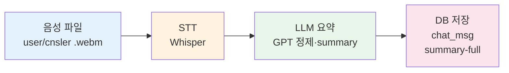

# 채팅·상담 파트 발표 요약 (3분 내) — 프론트(testchat) + 백엔드(testchatpy) 연동

## 1. 기술 스택

### 1-1. 프론트엔드 (testchat)

| 구분 | 기술 |
|------|------|
| **프레임워크** | React 18, React Router, Vite |
| **상태/인증** | Zustand (auth.store, useAiConsultStore, useChatbotStore), JWT (Spring 연동) |
| **실시간·DB** | Supabase (Realtime, PostgreSQL 조회/저장) |
| **API** | Axios(authApi), fetch — Spring(JWT) + testchatpy(FastAPI) |
| **화상 통화** | PeerJS, WebRTC (getUserMedia, MediaRecorder, ICE/STUN) |
| **UI** | Tailwind CSS, 반응형(모바일/PC) |

### 1-2. 백엔드 (testchatpy, FastAPI)

| 구분 | 기술 |
|------|------|
| **프레임워크** | FastAPI, Uvicorn |
| **DB** | PostgreSQL (db_pool 연결 풀), Supabase와 동일 DB 또는 연동 |
| **AI** | OpenAI API (gpt-4o-mini / gpt-4.1-mini), Whisper(STT) |
| **역할** | AI 상담 메시지·요약, 화상/텍스트 상담 채팅·요약, 사이트 챗봇 |

---

## 2. 프론트–백 연동 구조

| 프론트 컴포넌트 | 사용하는 백엔드 | testchatpy API / 역할 |
|----------------|----------------|------------------------|
| **AIChat.jsx** | testchatpy + Spring | `GET/POST /api/ai/chat/{cnsl_id}` — 메시지 조회·전송·AI 응답<br>`POST /api/ai/chat/{cnsl_id}/summary` — 요약 생성 후 ai_msg·cnsl_reg 반영 |
| **VisualChat.jsx** | testchatpy + Supabase | `POST /api/summarize` — 녹음+채팅 기반 요약·msg_data 반환<br>`POST /api/cnsl/{cnsl_id}/chat/summary-full` — 요약·msg_data 저장<br>채팅 메시지: Supabase `chat_msg` 직접 사용 |
| **CounselorChat.jsx** | testchatpy + Supabase | `POST /api/summarize` — 채팅만으로 요약 생성<br>`POST /api/cnsl/{cnsl_id}/chat/summary-full` — 요약·msg_data 저장<br>채팅: Supabase `chat_msg` + Realtime |
| **FloatingChatbot.jsx** | testchatpy + Spring + Supabase | `POST /api/site-chat` (또는 VITE_TESTCHATPY_CHAT_ENDPOINT) — 사이트 이용 안내 챗봇<br>세션/저장: Spring `/api/bot_msg/session` + Supabase `bot_msg` |

- **공통**: 프론트는 `VITE_API_BASE_URL`(예: https://api.gmss.site) 또는 `VITE_SUMMARIZE_API_URL`로 testchatpy를 호출. JWT는 Spring 경유 시 사용.
- **testchatpy**는 CORS로 testchat(예: Vercel) origin을 허용하고, `/api/ai`, `/api/cnsl`, `/api/summarize`, `/api/site-chat` 등을 제공.

---

## 3. testchatpy 백엔드 요약

### 3-1. 진입점·라우터 (app.py)

- **FastAPI** 앱, CORS 설정, 라우터 포함 순서:
  - `history_router` → `ai_chat_router` → `cnsl_chat_router` → `site_chat_router` → `summarize_router` → `ml_router`
- **AI 상담**: `ai_chat.py` — `/api/ai/chat/history`, `/api/ai/chat/{cnsl_id}` (GET/POST/DELETE), `/api/ai/chat/{cnsl_id}/summary`
- **1:1/화상 채팅**: `cnsl_chat.py` — `GET/POST /api/cnsl/{cnsl_id}/chat`, `PATCH /api/cnsl/{cnsl_id}/stat`, `POST /api/cnsl/{cnsl_id}/chat/summary-full`
- **사이트 챗봇**: `chatbot.py` — `POST /api/site-chat` (FloatingChatbot 연동)
- **화상 요약**: `summarize.py` — `POST /api/summarize` (음성 파일 + msg_data → STT + LLM 요약)

### 3-2. AI 상담 (ai_chat.py, ai_openai.py, ai_db.py)

- **ai_chat**: member_id(query) 검증, cnsl 소유 검증, 메시지 조회·추가·요약·삭제.
- **ai_openai**: OpenAI로 AI 상담 응답 생성 (시스템 프롬프트, mbti/persona 반영).
- **ai_db**: `ai_msg` 테이블 (cnsl_id, member_id, msg_data, summary), `cnsl_reg` 조회/수정, 연결 풀(db_pool) 사용.

### 3-3. 상담 채팅·요약 (cnsl_chat.py, chat_msg_db.py, summarize.py)

- **cnsl_chat**: `chat_msg` 조회/추가, cnsl_stat 업데이트, summary-full 저장. member_id/cnsler_id 권한 검사.
- **chat_msg_db**: `cnsl_reg`, `chat_msg` CRUD, msg_data.content 배열로 메시지 저장.
- **summarize**: 화상 상담 종료 시 채팅 + 사용자/상담사 음성 파일 업로드 → Whisper STT → LLM 정제·요약 → summary/summary_line + msg_data 반환. VisualChat/CounselorChat에서 이 결과를 summary-full로 저장.

### 3-4. 사이트 챗봇 (chatbot.py)

- **site-chat**: FloatingChatbot에서 호출. message, history, siteContext 받아 OpenAI로 JSON 응답(answer, summary). 고민순삭 사이트 이용 안내용.

---

## 4. 담당 컴포넌트 개요 (프론트 + 연동 포인트)

### 4-1. AIChat.jsx — AI 상담

- **역할**: 회원 ↔ AI **텍스트 채팅** (cnsl_tp=3).
- **라우트**: `/chat/withai`, `/chat/withai/:cnslId`.
- **프론트**: 세션 생성은 Spring(cnslApi), 메시지 조회·전송·요약은 **testchatpy** `/api/ai/chat/*`. JWT(getHeaders), member mbti/persona 전달, 1시간 제한·종료 시 요약 반영.
- **백엔드**: testchatpy `ai_chat` + `ai_openai` + `ai_db` (ai_msg, cnsl_reg).
- **발표 한 줄**: “회원이 AI와 1:1 텍스트 상담을 하고, **testchatpy(FastAPI)**와 OpenAI로 응답·요약을 생성해 DB에 반영했습니다.”

---

### 4-2. VisualChat.jsx — 화상 상담

- **역할**: 회원(USER) ↔ 상담사(SYSTEM) **화상 + 하단 텍스트 채팅** (cnsl_tp=5).
- **라우트**: `/chat/visualchat/:id`.
- **프론트**: PeerJS·WebRTC(ontrack 폴백), Supabase `chat_msg` 실시간, 녹화 후 **testchatpy** `/api/summarize`로 음성+채팅 요약 → `/api/cnsl/{id}/chat/summary-full`로 저장.
- **백엔드**: testchatpy `summarize`(STT+LLM), `cnsl_chat`·`chat_msg_db`.
- **발표 한 줄**: “화상 통화와 하단 채팅을 PeerJS·Supabase로 구현하고, 통화 종료 시 **testchatpy**로 음성+채팅 요약을 생성해 저장합니다.”

**시각 자료: 화상 상담 종료 후 요약 저장 흐름**

```
┌─────────────┐     ┌─────────────┐     ┌─────────────┐     ┌─────────────┐
│  음성 파일   │ ──▶ │     STT     │ ──▶ │ LLM 요약    │ ──▶ │  DB 저장    │
│ (user/cnsler)│     │  (Whisper)  │     │ (GPT 정제·  │     │ (chat_msg   │
│   .webm     │     │             │     │  summary)   │     │  summary-full)│
└─────────────┘     └─────────────┘     └─────────────┘     └─────────────┘
       │                    │                    │                    │
       │  + 채팅 msg_data    │  STT 문장 정제     │  summary,           │  cnsl_reg
       └────────────────────┴────────────────────  summary_line,      │  cnsl_stat
                            │                      msg_data 반환      │  업데이트
                            └────────────────────────────────────────┘
```

**Mermaid 순서도** (GitHub·Notion·일부 슬라이드 도구에서 렌더링 가능):



- **음성 파일**: 통화 녹화본(회원/상담사 채널) + 채팅 `msg_data`를 `POST /api/summarize`로 전송.
- **STT**: OpenAI Whisper로 음성 → 텍스트, 화자별·타임스탬프 포함.
- **LLM 요약**: STT 결과와 채팅을 합쳐 GPT로 정제 후 `summary`, `summary_line`, 최종 `msg_data` 생성.
- **DB 저장**: 프론트에서 `POST /api/cnsl/{cnsl_id}/chat/summary-full` 호출 → `chat_msg`에 요약·msg_data 저장, `cnsl_reg` 상태 반영.

- **슬라이드용 이미지**: `assets/화상상담_요약흐름_순서도.png` (음성 파일 → STT → LLM 요약 → DB 저장 순서도)

---

### 4-3. CounselorChat.jsx — 1:1 텍스트 상담

- **역할**: 회원 ↔ 상담사 **텍스트 전용** (cnsl_tp=4).
- **라우트**: `/chat/cnslchat/:id`.
- **프론트**: Supabase `chat_msg` Realtime, 진입 시 바로 채팅 가능. 종료 시 **testchatpy** `/api/summarize`(채팅만) → `/api/cnsl/{id}/chat/summary-full`로 요약 저장.
- **백엔드**: testchatpy `summarize`, `cnsl_chat`, `chat_msg_db`.
- **발표 한 줄**: “1:1 텍스트 상담은 Supabase Realtime으로 실시간 동기화하고, 종료 시 **testchatpy**로 요약을 생성·저장합니다.”

---

### 4-4. FloatingChatbot.jsx — 플로팅 챗봇

- **역할**: 전역 **플로팅 챗봇** + 상담 알림·설정.
- **프론트**: **testchatpy** `/api/site-chat`(이용 안내 챗봇), Spring `/api/bot_msg/session`·Supabase `bot_msg` 등과 연동. cnsl_reg A/C 알림, 설정(Zustand).
- **백엔드**: testchatpy `chatbot` (OpenAI 기반 site-chat).
- **발표 한 줄**: “플로팅 챗봇은 **testchatpy** 사이트 챗봇 API와 연동하고, 알림은 Supabase cnsl_reg로 진행 예정·진행 중 상담을 보여줍니다.”

---

## 5. 발표 흐름 (3분 예시)

1. **도입 (20초)**  
   “제가 담당한 부분은 **AI 상담, 화상 상담, 1:1 텍스트 상담, 플로팅 챗봇** 네 가지와, 이들과 연동되는 **FastAPI 백엔드(testchatpy)**입니다.”

2. **기술 스택 (30초)**  
   “프론트는 **React·Vite·Tailwind**로 구현했고, **Supabase**로 실시간 채팅과 DB를, **Spring**으로 인증과 상담 예약을, **testchatpy(FastAPI)**로 AI 상담·채팅·요약·사이트 챗봇 API를 제공합니다. 화상은 **PeerJS·WebRTC**로 P2P와 녹화를 구현했습니다.”

3. **AI 상담 (30초)**  
   “**AIChat**은 회원이 AI와 텍스트로 상담하는 화면입니다. **testchatpy**의 `/api/ai/chat`으로 메시지를 주고받고, OpenAI로 응답과 종료 시 요약을 생성해 ai_msg·cnsl_reg에 반영합니다.”

4. **화상 상담 (40초)**  
   “**VisualChat**은 회원과 상담사의 화상 통화와 하단 채팅입니다. PeerJS·WebRTC로 P2P를 구성하고, 원격 스트림은 track 이벤트 폴백으로 수신했습니다. 통화 종료 시 채팅과 녹음 파일을 **testchatpy** `/api/summarize`로 보내 STT와 요약을 만들고, 결과를 chat_msg에 저장합니다.”

5. **텍스트 상담 (25초)**  
   “**CounselorChat**은 상담사와 회원의 1:1 텍스트 상담입니다. Supabase **chat_msg**와 Realtime으로 실시간 동기화하고, 종료 시 **testchatpy**로 요약을 생성해 summary-full API로 저장합니다.”

6. **플로팅 챗봇 (25초)**  
   “**FloatingChatbot**은 우측 하단 플로팅 챗봇으로, **testchatpy**의 site-chat API로 사이트 이용 안내 답변을 받습니다. 같은 패널에서 진행 예정·진행 중 상담 알림을 보여주고 해당 상담방으로 이동할 수 있습니다.”

7. **마무리 (10초)**  
   “정리하면, **AI·화상·텍스트 상담**과 **플로팅 챗봇**을 React와 Supabase·Spring·**testchatpy(FastAPI)·WebRTC**로 연동해 구현했습니다.”

---

## 6. 참고: 파일·라우트·API 매핑

| 구분 | 프론트 (testchat) | 백엔드 (testchatpy) |
|------|-------------------|----------------------|
| AI 상담 | `pages/user/chat/AIChat.jsx`<br>라우트: `/chat/withai`, `/chat/withai/:cnslId` | `ai_chat.py`, `ai_openai.py`, `ai_db.py`<br>`/api/ai/chat/history`, `/api/ai/chat/{cnsl_id}` (GET/POST/DELETE), `/api/ai/chat/{cnsl_id}/summary` |
| 화상 상담 | `pages/user/chat/VisualChat.jsx`<br>라우트: `/chat/visualchat/:id` | `summarize.py` (`/api/summarize`), `cnsl_chat.py` (`/api/cnsl/{id}/chat/summary-full`), `chat_msg_db.py` |
| 1:1 텍스트 상담 | `pages/user/chat/CounselorChat.jsx`<br>라우트: `/chat/cnslchat/:id` | `summarize.py`, `cnsl_chat.py`, `chat_msg_db.py` |
| 플로팅 챗봇 | `components/FloatingChatbot.jsx` (전역) | `chatbot.py` (`/api/site-chat`) |

이 문서를 기준으로 슬라이드나 대본을 3분 분량으로 조절해 사용하시면 됩니다.
